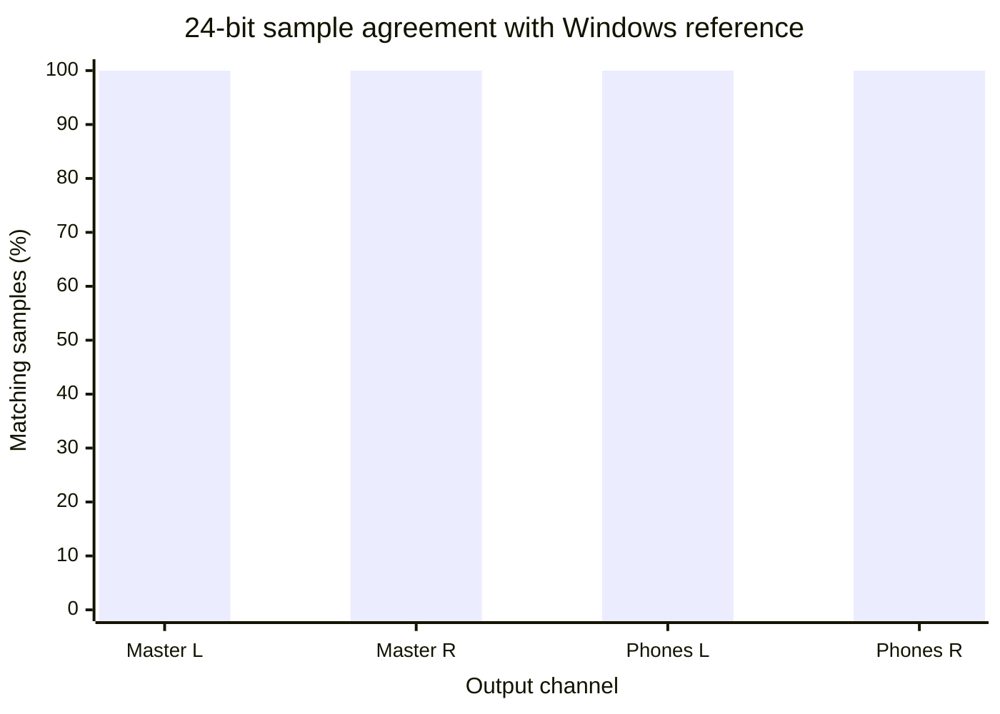
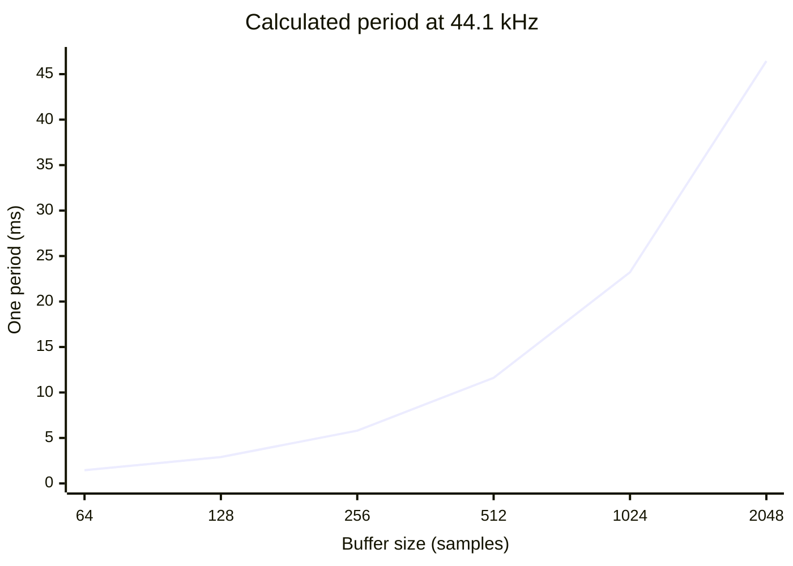
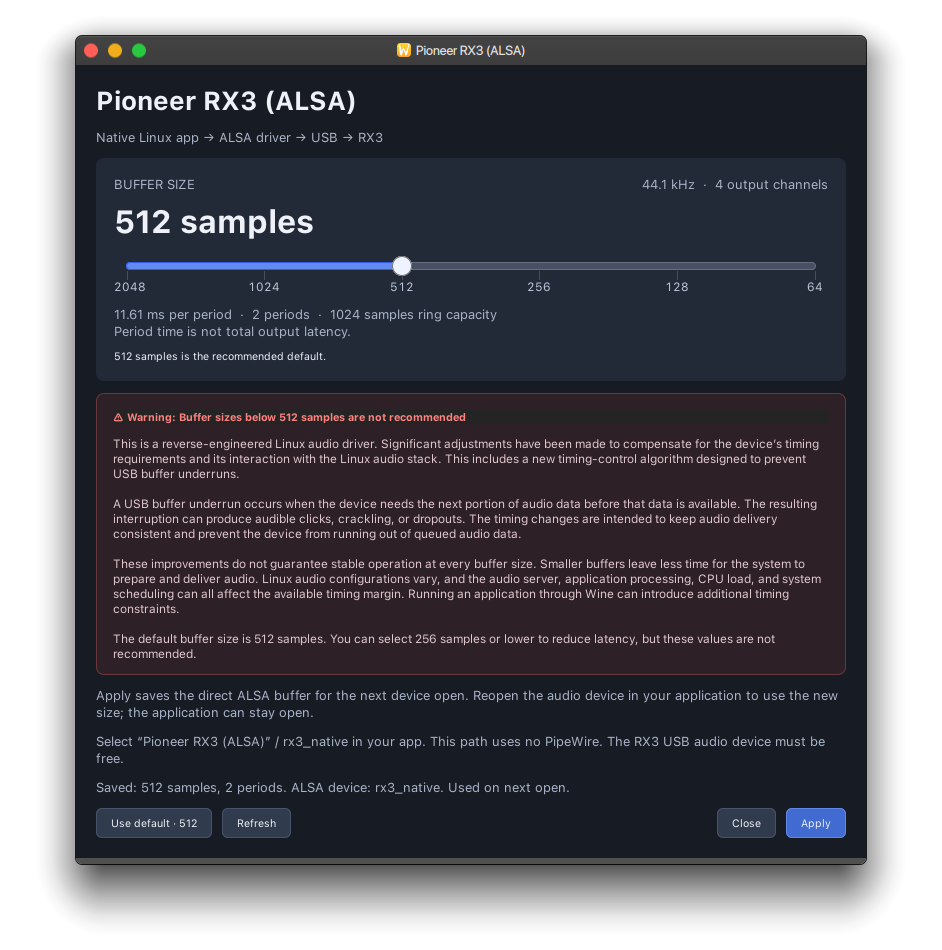

# DRAGON-X RX3 Linux Audio Driver

**DRAGON-X RX3 Linux Audio Driver** brings the RX3's computer-audio playback features to Linux. It is an experimental, reverse-engineered driver, built to be fully compatible with the RX3's four-channel USB audio output. Connect the RX3 in **Software Control** mode and enjoy separate Master and Headphones playback on Linux. 🎧

**Platform support:** The ready-to-install package targets **Arch Linux and Arch-based distributions on x86_64**. Installation uses `pacman`. Other Linux distributions are not packaged or verified yet.

### ✨ Audio features

- 🎚️ **Master + Headphones:** two independent stereo output pairs, four channels in total.
- 🎵 **24-bit audio at 44.1 kHz:** the same 24-bit sample values as the original Windows driver in our digital USB comparison.
- 🐧 **Native ALSA playback:** a direct Linux path without PipeWire between the application and the driver.
- 🍷 **Wine options:** WASAPI and ASIO paths for compatible Windows DJ software.
- ⚙️ **Separate buffer settings:** native ALSA, WASAPI, and ASIO each have a setup window with 64–2048 sample choices; 512 samples is the default.
- ⏱️ **Improved timing:** queued USB audio, a new timing-control algorithm, and ALSA poll scheduling help keep playback fed and reduce unnecessary software delay.

The digital comparison covers the audio data sent to the RX3; it does not establish analog output latency or guarantee support for every vendor control or DJ software feature. Smaller buffers may lower latency, but results vary by application and system. This is an independent project, not an official Pioneer or AlphaTheta driver.

### 📊 Digital audio comparison

The original Windows driver and this Linux driver sent matching 24-bit sample values on all four output channels in a matched USB capture: **573,300 frames × 4 channels = 2,293,200 compared samples, with 0 differences**. This checks the digital output data, not the analog signal at the RX3 connectors.



### ⏱️ Buffer period and observed interruptions

The curve shows **one buffer period**, calculated as `samples ÷ 44,100 × 1,000`. It is a timing budget, **not measured end-to-end or analog latency**. The `pw-top` RX3 node showed **ERR = 0** in the saved 256-sample and 512-sample observations; other buffer sizes were not covered by those live observations. Zero observed errors in a short run is not a stability guarantee.



| Saved live `pw-top` observation | Period | RX3 node `ERR` |
| --- | ---: | ---: |
| 256 samples | 5.80 ms | 0 across 57 active snapshots |
| 512 samples | 11.61 ms | 0 across 64 active snapshots |

## 📦 Install on Arch Linux

Extract `DRAGON-X_RX3_Linux_Audio_Driver_Setup.zip` and run the included script as your normal desktop user:

```sh
./Setup.sh
```

This installs **one package** containing the RX3 ALSA driver, the Wine/WASAPI integration, and PipeASIO. For native Linux software, select **Pioneer RX3 (ALSA)** (`rx3_native`). This path opens the ALSA driver directly and does not require PipeWire. The package also creates **RX3 Master + Headphones** in an available PipeWire session for Wine/WASAPI. PipeWire, WirePlumber, and pipewire-pulse are package dependencies for the Wine audio paths.

To register the included **RX3 Master & Headphones** ASIO driver for compatible DJ software in an existing 64-bit system Wine prefix, run:

```sh
./Setup.sh --asio-prefix '/absolute/path/to/existing/wine-prefix'
```

The script checks `SHA256SUMS.txt`, requests administrator rights through `sudo` for the package installation, and registers ASIO in the chosen Wine prefix as your desktop user. Do not run ASIO setup with `sudo`. The script does not fetch driver source; your package manager may install missing distribution dependencies. Your DJ software may need to reload its ASIO device list after an upgrade. Setup does not close your DJ software.

The application menu provides **Pioneer RX3 Audio Setup (Linux)**, **Pioneer RX3 Audio Setup (WASAPI)**, and **Pioneer RX3 Audio Setup (ASIO)**. The Linux entry opens **Pioneer RX3 (ALSA)**. Each window saves its own buffer choice: 2048, 1024, 512, 256, 128, or 64 samples. The default is **512 samples**. Native ALSA changes take effect when an application next opens `rx3_native`; ASIO/WASAPI changes configure the PipeWire path. Before switching between direct ALSA and PipeWire, release the RX3 audio device in the other application: only one path can open its USB audio interface at a time.



*The native Linux setup window at the recommended 512-sample default.*

To remove the installed package and its menu entries:

```sh
sudo pacman -R dragon-x-rx3-audio-driver
```

Personal settings and ASIO registration inside a Wine prefix remain after package removal.

## 🛠️ Build from source

The setup archive includes the corresponding RX3 and PipeASIO source trees and one combined `PKGBUILD` under `Source/`. On Arch Linux or an Arch-based distribution (x86_64), install the build dependencies through your package manager: `base-devel`, `pkgconf`, `alsa-lib`, `libusb`, `json-c`, `cmake`, `clang`, `lld`, and `wine`. The build command does not download source code.

```sh
cd Source
makepkg --config ./makepkg.conf --cleanbuild
```

The RX3 driver and ASIO registrar are released under **GPL-3.0-or-later**. PipeASIO also uses GPL-3.0-or-later. Its bundled Wine compatibility header retains its original **LGPL-2.1-or-later** notice; the corresponding license text is included. Copyright notices remain with their respective source files. The package contains no Windows vendor binaries, USB captures, or personal DJ software configuration.

## ⚠️ Warning

> ⚠️ **Buffer sizes below 512 samples are not recommended.**

This is a reverse-engineered Linux audio driver. Significant adjustments have been made to compensate for the RX3's timing requirements and its interaction with the Linux audio stack, including a new timing-control algorithm designed to prevent USB buffer underruns. An underrun occurs when the device needs audio before the next data is available; you may hear clicks, crackling, or dropouts.

These changes cannot guarantee stable playback at every buffer size. Smaller buffers leave less time for the application and system to prepare audio. CPU load, scheduling, the audio server, and Wine can all affect the available margin. The default is **512 samples**. You can choose **256 samples or lower** to experiment with lower latency, but those settings are not recommended.

**Please do not open an issue for crackling or dropouts at a buffer size below 512 samples.** First restore 512 samples and try to reproduce the problem. If it persists, include your audio configuration, application, and steps to reproduce it in the issue.

## ❓ FAQ

### Why do I hear dropouts or crackling?

Start by setting the buffer to **512 samples** in the setup window for the audio path you are using, then reopen the audio device in your application. If the problem persists, a real-time (RT) kernel may help on some systems. It is not a guaranteed fix: Linux systems differ in CPU load, USB controllers, scheduling, and application behavior, so the same buffer size can work differently on different machines. The driver contains timing improvements, but it cannot eliminate every system-level interruption.

For the PipeWire paths (Wine/WASAPI and Wine/ASIO), these two commands help inspect timing and interruptions while audio is playing:

```sh
pw-top
journalctl -k -f | rg --line-buffered -i 'rx3|usb|xhci|underrun|xrun'
```

In `pw-top`, find the RX3 node and check **RATE**, **QUANT**, and **ERR**. `QUANT / RATE` is the graph period, **not** measured end-to-end output latency; increasing `ERR` can indicate missed PipeWire processing deadlines. The second command follows kernel USB messages. Install `ripgrep` if `rg` is unavailable. Neither command detects every audible dropout, and `pw-top` does not monitor the direct native ALSA path.

### Why does my DJ software not show waveforms or respond to every control?

Waveforms, library displays, and controller actions depend on the DJ software and its HID integration, not just on audio playback. USB HID device nodes may also be writable only by root or users with suitable device permissions. This package focuses on the RX3 audio driver; although the underlying work includes HID-related capabilities, it does not guarantee full HID integration with every application. Check the application's device support and permissions separately.

### Will you support other Pioneer DJ devices, such as the CDJ-3000?

There is no support promise for other models. Reverse-engineering the RX3 audio path was substantial work, and I no longer have a CDJ-3000 to develop and verify a port. The source code may be useful as a starting point, but similar-looking devices should not be assumed to use identical USB protocols or timing.

### Should I use native Linux ALSA, ASIO, or WASAPI?

Use **Pioneer RX3 (ALSA)** when your Linux application can open it: it is the shortest path to the device and avoids an audio server in between. For Windows applications under Wine, choose the interface the application supports best. The included WASAPI and ASIO options both work through Wine and PipeWire and therefore add layers; neither is guaranteed to have lower latency or better stability on every system. ASIO and WASAPI are available for compatibility and experimentation, while native ALSA is the preferred Linux path.
